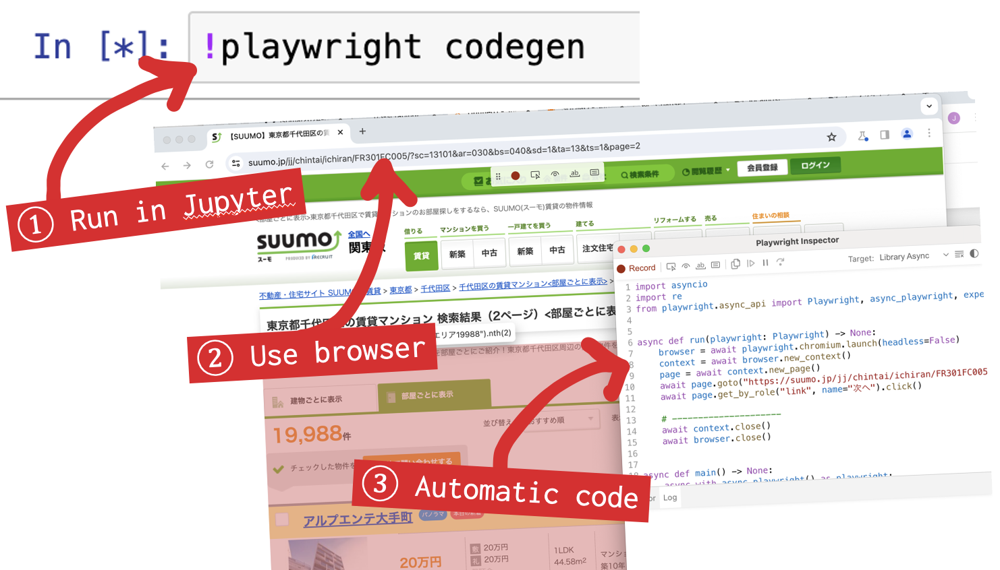
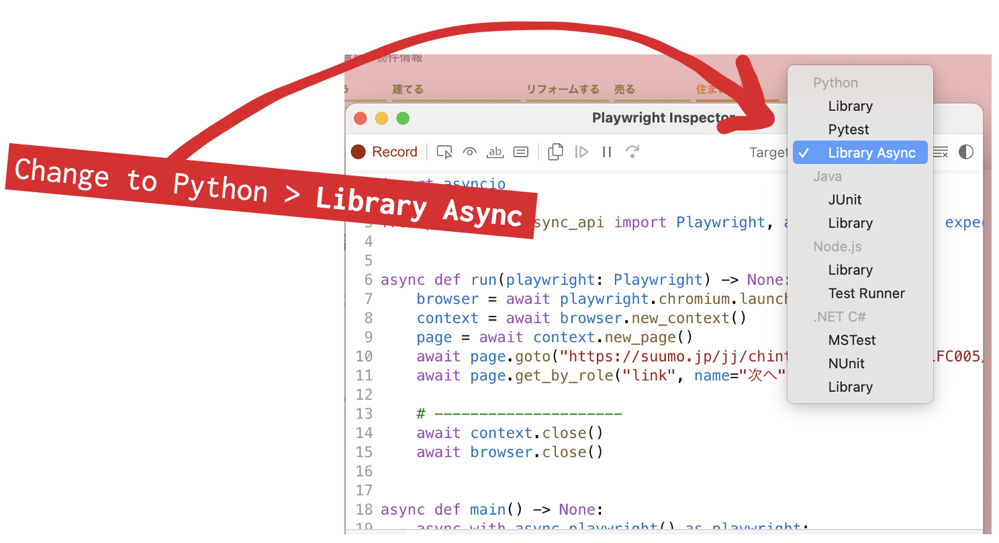

[Playwright](https://playwright.dev/python/) is a great library for scraping data in Python.

# Session content

## Code and data

This morning you will create your own notebooks!

- Data cleaning notebooks are included in this folder

## Slides

- Scraping slides are available in the main section

## Homework

- Continue working on the data cleaning notebooks from the pandas section
- Try the `02-cleaning-worksheet.ipynb` notebook in this folder. Use your data cleaning skills to extract the appropriate data (and don't look at the completed version!)
- [Scrape some content from here](https://www.national-azabu.net/products/list?category_id=52)

## Setup

Playwright is installed using `pip`. It also needs many other tools to make sure our code will work. Please run the code below in a Jupyterlab Desktop notebook cell:

```bash
%%python -m pip install lxml html5lib beautifulsoup4 pandas playwright
```

Then we need to install web browsers for Playwright to use. Use the code below. **Notice the note below if you receive an error.**

```bash
!playwright install
```

> **If you get an error** with `!playwright install`, try to run this code for your install:
> 
> ```bash
> %pip install lxml html5lib beautifulsoup4 pandas playwright
> ```
>
> if that does not work, try `!pip install` (`!` instead of `%`), and if that does not work try `pip install` (no `%`, no `!`)
>
> Then try to run `!playwright install` again

If you use Windows, you also need to **few more lines** to make Playwright work in Jupyter.

```py
%%python -m pip install --quiet "ipykernel==6.28.0"
get_ipython().kernel.do_shutdown(restart=True)
```

## Additional links

- [Scraping with Playwright](https://www.youtube.com/watch?v=UPQQ3cyFrpg), a video

# Guide

## Starting the prompt

First, paste [this custom prompt](https://jsoma.github.io/2024-ds-dojo/scraping-prompt-2.html) into ChatGPT. It will walk you through the process

## Getting basic code

For the first step, ChatGPT will ask you to run `!playwright codegen`. This will open a new browser.

Use this browser to visit the page you want to scrape, fill out any forms you need (dropdowns, inputs, buttons), and click a "next" button if necessary.



There is a second window that will write code for you. This will teach ChatGPT how to use the website.

Before you cut and paste the code into ChatGPT, use the dropdown to change the code to **Python > Library Async**



## Opening the web inspector

Next, ChatGPT will ask you to explain the HTML of your "row" of data. Right-click (or command-click) to bring up the menu, then select **Inspect** (**検証** in Japanese Chrome). It might be slightly different if you aren't using Chrome!


### Using the web inspector

Move your mouse around on the code on the right.

<video autoplay muted loop>
  <source src="finding-divs-resized.mov" type="video/mp4">
  Your browser does not support the video tag.
</video>

Or click the 'select' button and click what you are interested in

<video autoplay muted loop>
  <source src="clicking-resized.mov" type="video/mp4">
  Your browser does not support the video tag.
</video>

Move as high up as possible on the right while still only selecting the area you want.

## Getting the code

To get the HTML code for part of the page, first find it using the Web Inspector. Then **right click, Copy, Copy outerHTML.** You will paste this into ChatGPT to help write your scraper.


## Pagination

For the next step, repeat the process above to get the HTML code for the **pagination** area. This will teach ChatGPT how to use "next" buttons.

## Fixing the output

The code that ChatGPT produces is **always a little wrong** at first. Add this prompt after ChatGPT gives you its code to improve it:

<pre class="prompt">
Remember my important notes!
- Use async playwright with async/await
- Do NOT use asyncio
- Flatten the code to not use functions, so the data and df are available in other cells
- No main function

We are just testing this now. Have it scrape a maximum of 5 pages.
</pre>

## Iterating

You might be done! If you get an error, paste it into ChatGPT to get new code as an answer. If you get another error, paste that error in.

**After two errors, just start from the beginning in a new chat.** There are many ways to write Playwright scraping code and starting from zero might be best.