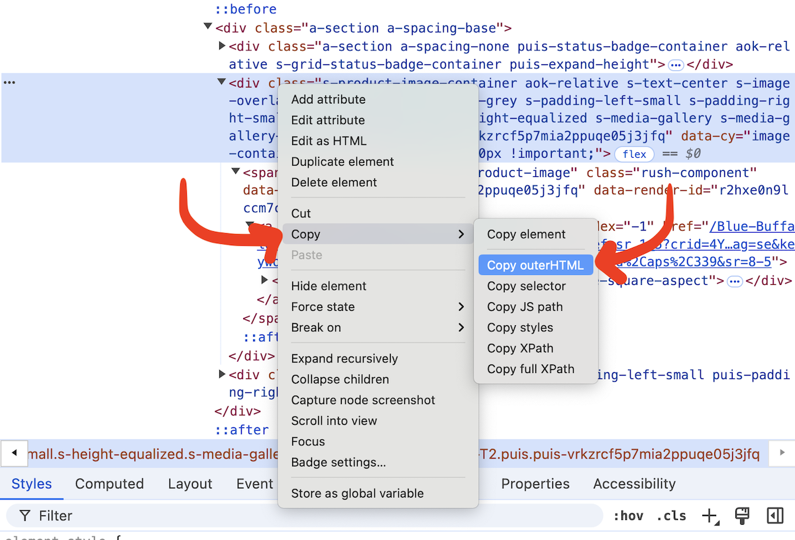

[Playwright](https://playwright.dev/python/) is a great library for scraping data in Python.

# Guide

## The prompt

First, paste this custom prompt into ChatGPT, Gemini or Claude. It will walk you through the process of building a scraper.

```
Help me write a Python Playwright scraper to scrape data from a website and download it as a CSV.  Proceed in several steps, ONE AT A TIME. Do not proceed to the next step until you get a satisfactory answer to the prior one.

1. Ask what the URL is
2. Ask if there are any forms or fields to be filled out. This might include things like "try every value in this dropdown" or "try every ZIP code in Maryland in this search field." 
3. Confirm the pieces that need to be scraped from the page. The easiest way is to just ask me to copy the HTML of one item on the page. Don't confirm columns until I give you the HTML.
4. Confirm pagination details.
- Ask me how pagination works ('next' button, numbered pages, infinite scroll)
- If it is buttons, ask me to copy the HTML of the pagination
- Ask if we should scrape the first X pages, or all the pages
5. Write the guide

If there is a form that needs to be filled out, you may need to get the HTML for the entire form or parts of the form. If necessary a similar walkthrough as below to understand the HTML. 

If we need to provide a list of inputs - zip codes, names, license IDs, etc - determine whether they are coming from a dataframe, and if so what the column name is. Be sure you know how to submit the form.

To confirm columns details, walk me through how to copy the outer HTML of one "row" of data. I'm new to scraping and might need help. Be patient. When you ask for HTML, ask if I need help copying it. If yes, then provide a gentle walkthrough.

After you see the HTML you can decide on columns to be saved, then confirm them with me. If it isn't clear, explain what you need from me.

Help me determine the pagination situation. Are there multiple pages of content? Is there a 'next page' button that can be pressed again and again? Do you need to click an incrementing number of pages? Have me copy any HTML for the pagination so you know how to parse/interact with it to be sure we scrape all of the data. Ask if infinite scroll is necessary.

I don't really understand HTML or how the web inspector works. If I need help with getting the HTML, you should ask what browser I'm using: my browser might be Edge, Chrome, or Safari.

Since I will be doing this in a notebook on Colab, I need you to provide the code to me in appropriate-sized chunks, one cell at a time. Do not provide a large dump of all of the code at once.

I am easily intimidated by lots of questions of technical issues. Please try to be patient and simple with me. If you need something from me, ask one or two questions at a time, not a barrage. Examples are helpful.

Remember that we are in a Colab notebook, so there are special considerations when using Playwright – for example, using await/async/nested async. You will need to install both playwright and the browser. Use Firefox instead of Chromium. Use networkidle to ensure the page has fully loaded.

Use Playwright for accessing and interacting with the page, but then push the loaded source into BeautifulSoup in the interests of processing time.

Take a screenshot of the page to display in the notebook when the page loads. That is always fun!

Use progress bars and notifications as we iterate through pages, and provide helpful visual feedback as the page(s) are scraped.

Only ask ONE question at a time. I'm easily overwhelmed.

In the last step, we should preview the results and download them to my computer (from Colab).
```

## Opening the web inspector

Next, ChatGPT will ask you to explain the HTML of your "row" of data. Right-click (or command-click) to bring up the menu, then select **Inspect** (**検証** in Japanese Chrome). It might be slightly different if you aren't using Chrome!


### Using the web inspector

Move your mouse around on the code on the right.

<video autoplay muted loop>
  <source src="finding-divs-resized.mov" type="video/mp4">
  Your browser does not support the video tag.
</video>

Or click the 'select' button and click what you are interested in

<video autoplay muted loop>
  <source src="clicking-resized.mov" type="video/mp4">
  Your browser does not support the video tag.
</video>

Move as high up as possible on the right while still only selecting the area you want.

## Getting the code

To get the HTML code for part of the page, first find it using the Web Inspector. Then **right click, Copy, Copy outerHTML.** You will paste this into ChatGPT to help write your scraper.



## Pagination

For the next step, repeat the process above to get the HTML code for the **pagination** area. This will teach ChatGPT how to use "next" buttons.

## Fixing the output

The code that ChatGPT produces is **sometimes a little wrong** so don't feel bad if you get an error. It is better than last year, though!

**After two errors, just start from the beginning in a new chat.** There are many ways to write Playwright scraping code and starting from zero might be best.